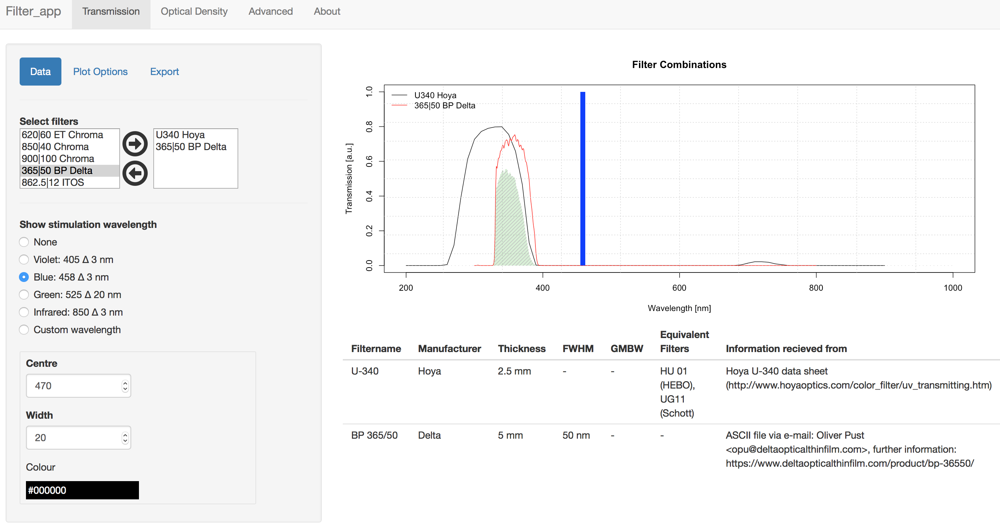

# Filter app

The 'Filter_app' is a [Shiny](http://shiny.rstudio.com) providing a graphical user interface for the function `plot_FilterCombinations()` from the **R** package ['Luminescence'](https://CRAN.R-project.org/package=Luminescence). The app allows visualising optical filter characteristics, including optical density 
and transmission data needed in the broader context of [luminescence dating](https://en.wikipedia.org/wiki/Luminescence_dating).

The application was developed in framework of an internship at the 
[IRAMAT-CRP2A](http://www.iramat-crp2a.cnrs.fr/spip/) at the Université Bordeaux Montaigne, France. 

**Due to legal restrictions the app itself comes without *any* filter data, but a template that can be quickly filled with own information. For details see below.**

## Impressions

Overview of the main functions of the 'Filter_app'.

## Installation and usage

The application can be either run on a local device or an external
[Shiny Server](https://www.rstudio.com/products/shiny/shiny-server/).

Due to legal restricions the app comes with a template excel sheet (`/template/template.xlsx`), in which only random example filter data are given.
To use one's individual filter data a new folder called '`Data`' has to be generated in the repository of the app (`/Filter_app/Data`), containing a '.xlsx' file with the filter data. Therefore the *Excel (TM)* template can be copied and renamed in the '`Data`' folder and filled with own information afterwards. 

**Note that only the first '.xlsx' file in the 'Data' folder will be used by the app**

The data required to run the 'Filter_app' comprises the optical transmission values for the corresponding  wavelenghts (in nm) of the filters. The raw data are often given as ASCII data at the manufacturers website (Example: [414/46 nm BrightLine HC Semrock](https://www.semrock.com/filterdetails.aspx?id=ff01-414/46-25)).

The optical density can be easily calculated from the transmission values as shown in the template. Additionally useful meta data (e.g., filter thickness, FWHM) can be included to the data base. 

## License

This program is free software: you can redistribute it and/or modify
it under the terms of the GNU General Public License as published by
the Free Software Foundation, either version 3 of the License, or
any later version.

This program is distributed in the hope that it will be useful,
but WITHOUT ANY WARRANTY; without even the implied warranty of
MERCHANTABILITY or FITNESS FOR A PARTICULAR PURPOSE.  See the
[GNU General Public License](https://github.com/LaikaNo2/Filter_app/blob/master/LICENSE) 
for more details.

The 'chooser.R' R-script and 'chooser-binding.js' Java Script used in this program are taken from the [shiny-example](https://github.com/rstudio/shiny-examples) repository under the [MIT License](https://github.com/rstudio/shiny-examples/blob/master/LICENSE).
